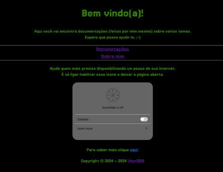

## Olá Mundo!

### Apenas um católico entusiasta em linux e OpenSource!

🧐 Em busca de mais conhecimento.

❤️ Atualmente estudando o Catecismo.

"Non Nisi Te, Domine" - Nada Além de Ti, Senhor!
  
___

  ### Conhecimento em:

  

    
     
    
    
    
    
    
    

##

  ### Meus sistemas favoritos:

  
   
  

___

# Projetos

 
   

  <a href="https://linuxlove.duckdns.org">**Linuxlove**</a>

<!-- 
___

  ### Fale comigo

-->
___

___

  </a>

